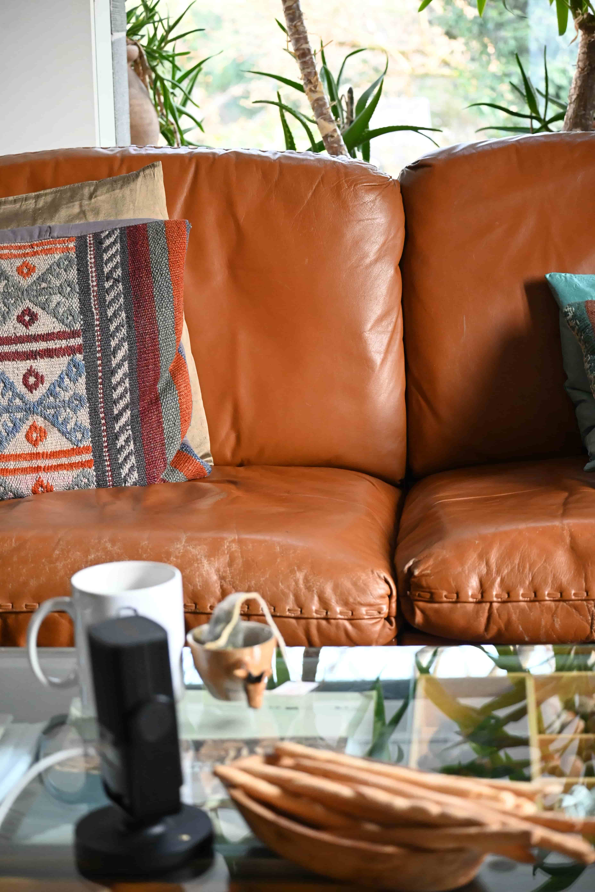

+++
title = "Wie ist es eine Sehbehinderung zu haben?"
date = "2023-03-19"
draft = false
pinned = false
image = "7aff7093-dd29-4f97-808c-174478a0261e-min.jpeg"
+++
**Andere Sichtweise aufs Leben**



Die 20 jährige Irene Stüssy erzählt von ihrem Leben als Studentin mit einer Sehbehinderung, wie sie durch ihr Alltag kommt und warum sie Theologie studiert. 



")

**Genaue Bezeichnung:**

Sehr spannende Frage, die meisten Leute differenzieren zwischen: du kannst sehen oder nicht. Bei etwasem dazwischen, ist man eigentlichen dazu gezwungen darüber zu sprechen. Was denn die Schwierigkeiten im Alltag sind oder was eim jetzt schwieriger fällt. Von aussen sieht es nur so aus: du kannst normal laufen, du kannst gar nichts haben und so ist es dann auch nicht. Also ja, es ist irgendwie etwas dazwischen. Man könnte schon fast sagen eine art Zwischenwelt, weder bei den einen noch bei den anderen. Es ist aber generell auch eine individuelle Sache. Man kann den Begriff Sehbehinderung nicht auf alle anwenden.

**Wie ist es dazu gekommen?**

Ich bin damit auf die Welthgekommen. Meine Eltern haben es gemerkt, als ich etwa eineinhalb war. Bei der zwei Jahreskontrolle konnte ich immernoch nicht richtig sehen und ab dem Punkt sind wir dann zu einer Augenärztin und da ist raus gekommen, wie „schlimm“ es eigentlich ist. Einige Zeit später habe ich auch meine erste Brille bekommen, weil ich dazu noch extrem weitsichtig bin. Die Brille dient aber gleich wie bei allen anderen die eine Brille tragen müssen.

**Wie reagieren Leute darauf wenn sie dich neu kennenlernen?** 

Sehr untrerschiedlich. Es gibt Leute, die sogar ungläubig sind. Wenn ich zum Beispiel die Linsen drinnen habe, gibt es Leute die mir nicht glauben, dass ich eine Sehbehinderung habe. Aber mit meinen jetzigen Freunden war es zum Beispiel von Anfang an kein Thema oder besser auf eine völig andere Art. Einge haben es natürlich auch in der Schule mitbekommen und da habe ich mit den einen mehr mit den anderen weniger darüber gesprochen. Im Studium aber rede ich eigentlich nicht mehr darüber. Es zu einem gewissen grad auch etwas sehr persönliches. Und manchmal hat man dann auch einfach keine Lust, allen immer wieder das erklären zu müssen, was ich denn jetzt genau habe.



Irene Stüssy ist zwanzig Jahre alt. Seit sie klein ist hat sie ein Sehbehinderung. Jetzt setzt sie sich in der Behinderten Session für ihre Rechte ein und will dafür sorgen, dass sie in ihrem Leben so wenig Nachteile wie möglich hat.



**Schwierigkeiten im Alltag:**

Die Karte im Restaurant Lesen zum Beispiel. Am Abend ist es sowieso schon dunkel, dass ist auch nicht hilfreich. Was auch noch mühsam ist, ist zum Beispiel in einer Bäckerei. In vielen Bäckereien gibt es kleine Schilder, auf denen steht, wie die Dinge genau heissen. Doch sehen alle Brötchen leider gleich aus, da muss ich dann wieder nachfragen. Auch bei der Migros einkaufen. Wenn sie die Dinge im Laden umstellen oder sie die Verpackungen ändern, ist es sehr mühselig, die Einkäufe zu erkennen.

**Du studierst Theologie in Basel, hat deine Einschrenkung deine Studienwahl beeinflusst?**  

(Kurze Denkpause) Ja. Ich wusste schon immer, ich kann keine Pilotin werden oder Lastwagenfahrerin. Es ist trotzdem wichtig das man nur das in Betracht zieht, was realistisch ist. Meine Eltern wussten aber auch schon immer „wir wussten das Irene in den Gymer kann, dann schauen wir, dass das geht.“ Inhaltlich hatote ich im Gymnasium nämlich keine Probleme. Ich hatte auch nie das Gefühl, dass ich was meine Berufswahl angeht, einen Nachteil habe. Ich habe mir zuerst überlegt Klassischen Gesang zu Studieren. Mein anderer Plan war dann Medizin zu Studieren. Doch für gewisse Dinge wie Sezieren, Obduzieren etc. braucht es eine gewisse Präzision. Ich weiss zwar ich hätte die Fähigkeit dazu, doch schon die Vorraussetzungen für die Prüfungen wären dann unfair. Ich wäre aber in die Richtung Psychiatrie gegangen, weil ich gerne mit Menschen Arbeite und mich generell sehr für die Geschichte anderer interessiere. Die Vielfältigkeit in der Theologie hat mich aber dann doch fast am meisten fasziniert. Mit so vielen Unterkategorien fällt es mir auch in der Theologie leicht mich für Dinge zu faszinieren.

> Es ist ein Fluch und ein Segen zugleich.