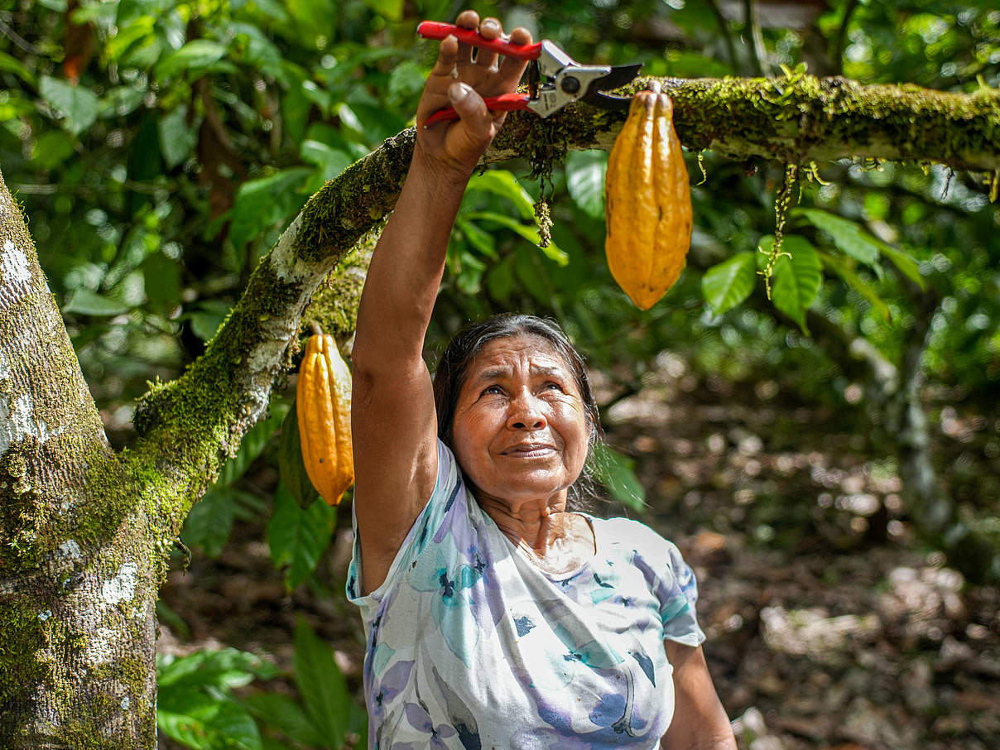

+++
title = "Hat Schokolade eine Zukunft?"
date = "2024-03-04"
draft = false
pinned = false
image = "img_5881.jpeg"
+++
# Hat Schokolade eine Zukunft?

In meiner Maturaabreit geht es zwar um Kakao, nichtsdestotrotz muss man auch bedenken was aus diesen Kakakobonen später wird. Ohne Kakao wäre handelsübliche Vollmilchschokolade eine Mischung aus Zucker und Milchpulver. Wenn jedoch noch Kakaomasse und Kakaobutter ins Spiel kommen, bekommt man eine braune süssliche dickflüssige creme, die uns allen unter dem Namen Schockolade bekannt ist. In der Schweiz isst man pro Kopf durchschnittlich 11Kg Schokolade pro Jahr.[\[1]](#_ftn1) Nun stellt sich die Frage, ob eines meist verbeiteten Markenzeichen der Schweiz nachhaltig ist.

Da Kakao einer der Grundbausteine der Schokolade ist, müsste geklärt werden, woher er kommt und zudem wie hoch der Anteil der Bauern am Schokoladenpreis eigentlich ist. 2012 soll der Kakao an der Europäischen Börse für 1.698 Euro (Stand 05.04.2012) gehandelt worden sein. Pro Tafel Vollmilchschokolde, solle also Kakao im Wert von 6.3 Cent verwendet werden. Daraus lasse sich errechnen, dass Bauern in Ghana bei einem Preis von 0.79 Euro pro Tafel Schokoldae (100g), 5.6% des Landenpreises erhalte.[\[2]](#_ftn2) Mit so einer geringen Gewinnmarge, ist es für viele Kakao Bauern unmöglich ein anständiges Leben zu führen. Das deutsche Bundes Ministerium für wirtschaftliche Zusammenarbeit und Entwicklung meint, dass viele Haushalte nur auf ein Monatseinkommen von umgerechnet 172 Euro kommen würde. Von denen 172 Euro, würden 99 Euro aus dem Kakaoanbau stammen.[\[3]](#_ftn3) Der soziale Aspekt wird bei vielen Schokoladenhersteller aussen vor gelassen. Klar der Anteil an die kleinen Bauernhöfe (Abb 1.) variiert stark von Firma zu Firma, dennoch legen grosse Firmen häufig nicht grossen Wert auf die ethische Vertretbarkeit ihrer Schokolade. Bei kleineren Frimen kann es aber auch anders aussehen. 

So sagt Elisa Scheidt, Marktleiterin von *Fairafric:*

> "Wenn man sich eine konventionelle Tafel Schokolade vorstellt, bleiben da vielleicht sechs bis sieben Cent im Ursprungsland. Wenn es eine faire Schokolade ist, kann es schon acht, neun oder zehn Cent sein, je nach Unternehmen. Bei uns ist es über einen Euro, der im Ursprungsland bleibt." [\[4]](#_ftn4)

 Ausserdem unterscheiden sich die Preise auch noch je nach Region. Die Elfenbein Küste und Ghana sind weltweit die grössten Kakao Exporteure und machen rund 60% des Kakaomarktes aus. Wobei in der Elfenbeinküste etwa 44% des globalen Kakao angebaut wird.[\[5]](#_ftn5) Auch Umwelt technisch lässt der Kakaoanbau auch zu wünschen übrig. Abgesehen von den tausenden Tonnen CO2, die nicht nur bei der Produktion von Schokolade aber auch beim Transport verursacht wird, kann auch von Schäden vor Ort berichtet werden. Die dortige Landwirtschaft muss aus verschiedensten Gründen auf andere bewirtschaftbarte Flächen ausweichen, was die Rodung weiterer Waldgebiete zu Folge hat. Niedrige Eträge, Bevölkerungswachstum und der Klimawandel sind Gründe der neu Lokalisierungen der Plantagen.[\[6]](#_ftn6)

Grundsätzlich lässt sich also feststellen, dass Schokolade nicht sehr nachhaltig ist. Es zählt zwar nicht als Grundnahrungsmittel, ist aber global so weit verbeitet, dass man es fast meinen könnte. Ein Luxusgut ist es lange nicht mehr. Es als eine schwierige Aufgabe zu bezeichnen, an billige Schokolade zu kommen ist beinahe lächerlich. Trotz der umweltschädlichen und ethischen Aspekte der Schokoladenproduktion, ist es für viele ein Genuss. Schokolade hilft hauptsächlich gegen Stress oder Liebeskummer, sollte aber mit dem Begriff Nachhaltigkeit nicht, als Vorzeigeprodukt in Verbindung gebracht werden. 

 

Abbildung 1:

Kleinbäuerin Magdalena Vargas bei Kakao-Ernte (Quelle: <https://www.wwf.de/themen-projekte/landwirtschaft/produkte-aus-der-landwirtschaft/kakao/schokoladen-scorecard>)

Literatur:

**\[1] Schweizerische Eidgenossenschaft** (6.6.2023) *Schweizer Küche- Fakten und Zahlen. Abgerufen am 4.3.2024 von <https://www.eda.admin.ch/aboutswitzerland/de/home/gesellschaft/schweizer-kueche/schweizer-kueche---fakten-und-zahlen.html#:~:text=Niemand%20isst%20mehr%20Schokolade%20als,und%20Person%20sind%20es%2011kg>*

**2 Hütz-Adams**, F. (2012). *Vom Kakaobaum zum Konsumente*n. Süd Wind. Mai 2012. S.28

**4 Dallmus**, A. (21.10.2021) *Nachhaltige Schokolade-gibt es die überhaupt?* Abgerufen am 4.3.2024 von <https://www.br.de/radio/bayern1/inhalt/experten-tipps/umweltkommissar/fairtrade-schokolade-100.html>

**5 Schweizer Plattfrom für nachhaltigen Kakao,** (2022/2023) *Produziert im Süden- konsumiert im Norden.* Abgerufen am 4.3.2024 von <https://www.kakaoplattform.ch/de/ueber-kakao/kakao-statistik>

 **6 Trummer**, U. et al., (2020) *Schoko-Advendskalender im Nachhaltigkeitscheck.* Abgerufen am 4.3.2024 von <https://www.wwf.de/fileadmin/fm-wwf/Publikationen-PDF/Landwirtschaft/WWF-Adventskalender-Check-2020.pdf>