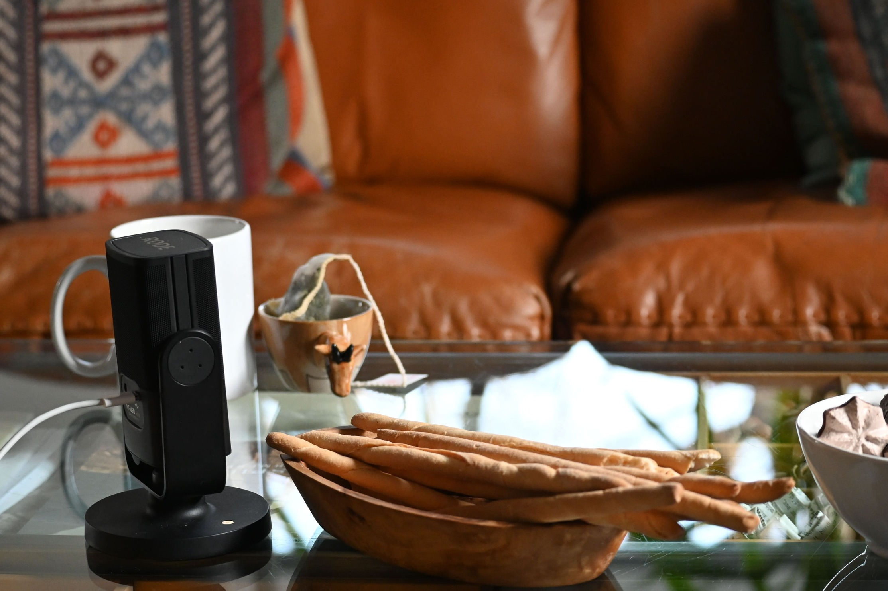
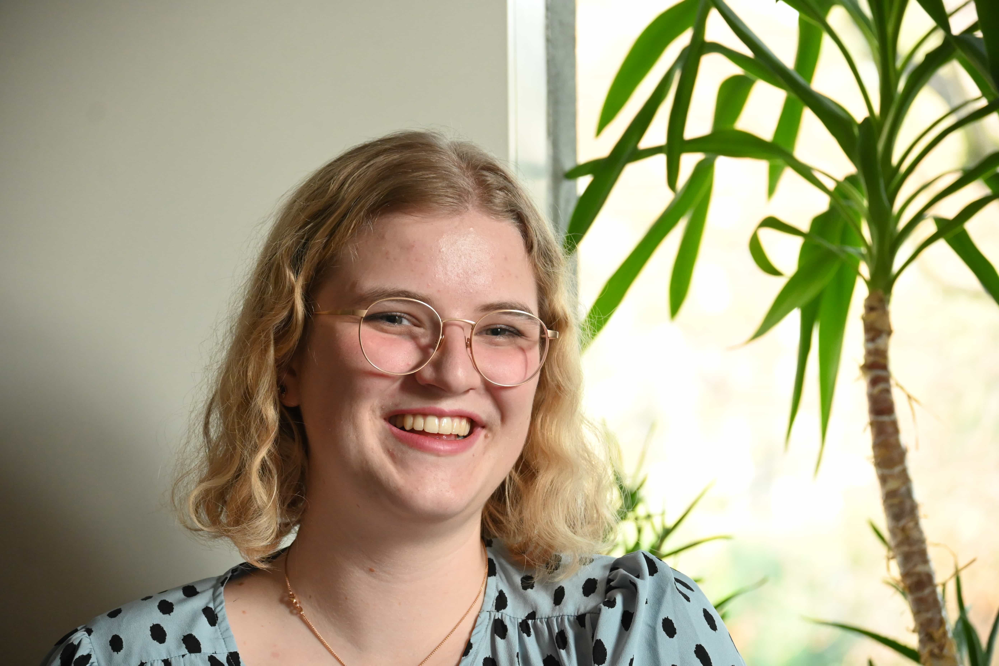

+++
title = "Mit viereinhalb Sinnen durchs Leben"
date = "2023-05-02"
draft = false
pinned = false
image = "70fdd1a4-ff03-4457-9d94-93534ee98c05-min.jpeg"
footnotes = ""
+++

 ***Wie kommt man mit fast einem Sinn weniger durchs Leben? Eine Sehbehinderung ist erstmals vielleicht eine erschreckende Diagnose, doch kommt man damit klar? Sich in einer Stadt orientieren zu können oder neue Orte kennenlernen scheint eine völlig neue Hürde zu sein.***  

Ein Brioche oder ein Gipfeli? Ich habe noch vielleicht drei Franken. Fühlt sich jedenfalls so an. Reicht das? Vielleicht sollte ich fragen gehen was das dort hinten links in der Vitrine neben dem grell grünen Carac liegt.

Solche Situationen sind sicherlich nicht für alle alltäglich. Überall sind Informationen, Hinweise und Preise angeschrieben, doch was wenn man von weitem kleine schnörkelige Schriften nicht lesen kann? Kommt man so genau gleich durch die Welt wie wenn man alles klar sieht? Wo tauchen Hürden und Schwierigkeiten auf, die man vor lauter Dinge die man sehen kann, vielleicht sogar übersieht? Diese Fragen und noch weitere sollten mit einem Gespräch mit der jungen Studentin aus Basel Irene Stüssy, nachgegangen werden.

Irene hat eine Sehbehinderung.

 Man gillt offiziell mit einer Sehstärke von unter 0.3 als Sehbehindert. In der Schweiz hat es Stand 2019 in der Schweiz rund 50‘000 blinde 270‘000 Menschen mit einer Sehbehinderung. 1.8% davon sind jüngere Erwachsene zwischen dem 20. und 39. Lebensjahr.

**Begrifflichkeit**

Doch was heisst Sehbehindert? Ich habe Irene gefragt was die korrekte Begriffligkeit ist oder beziungsweise, wie sie es bezeichnen würde. Es ist schwer zu sagen was alles zu dem Begriff gehört. Der Begriff „Behinderung“ wird so in Fachkreisen eigentlich nicht verwendet. Dieser Ausdruck hängt von verschiedenen Faktoren ab die eine Rolle spielen. Ob die Sehbehinderung durch einen Unfall, eine Krankheit oder schlicht weg dadurch entsteht, dass es im alter üblich sein kann, dass das Sehvermögen abnimmt. Zunächst war nicht ganz sicher ob man den Begriff “Behinderung” brauchen kann, doch Irene selbst hat den Begriff so selbst verwendet. Solange der Begriff nicht wertend ist, kann er verwendet werden.

**Der Anfang**

Irene hat seit ihrer Geburt ein Problem mit den Augen. Man war sich am Anfang nicht sicher, was es genau ist. Im Laufe der Jahre hat man zudem noch gemerkt das sie an Weitsichtigkeit leidet, wie es eigentlich relativ viele tun. Im Schnitt leiden 35% aller vor dem 50. Lebensjahr an Weitsichtigkeit. Nach dem 50. Lebensjahr nimmt die Zahl rasant zu. Später hat Irene noch dazu eine Brille bekommen. Allerding hat die Brille nichts mit der Sehbehinderung zu tun, sondern dient, wie bei allen anderen die eine Brille tragen, schlichtweg dazu in die Weite sehen zu können. 

**Der Alltag**

Allgemein ist das größte Problem Dinge lesen zu können. Zum Beispiel im Restaurant, wenn es sowieso schon dunkel ist, eine klein gedruckte Karte zu lesen, kann sehr schwierig sein. Wenn im Supermarkt Regale oder einzelne Produkte den Platz wechseln oder umgestellt werden, sich da wieder orientieren, ist auch einer dieser Punkte, an die man vielleicht nicht denkt, wenn man darüber nachdenkt wo Schwierigkeiten im Alltag auftauchen könnten. So kann ein einfacher Besuch im Laden viel länger und mühseliger werden als gewohnt.

> Es ist ein Fluch und ein Segen zugleich. 

**Karriere**

Pilotin oder Lastwagenfahrerin zu werden war schon immer ausgeschlossen, es ist wichtig immer realistisch zu bleiben, obwohl man gleichzeitig sein Potential voll ausschöpfen will. Doch das der gymnasiale Weg eine Option ist, war schon immer bekannt. Irenens Eltern sind immer davon überzeugt gewesen, dass sie in den Gymer gehen kann und haben auch dafür gesorgt, dass sie die Möglichkeit dazu hat. Nach dem Gymnasium will Irene studieren gehen. Zuerst ist klassischer Gesang eine Option, was sie sich aber dann doch anders überlegt. Im Raum stand auch noch Medizin, doch für Gewisse Dinge wie Sezieren oder Obduzieren, braucht es aber eine gewisse Präzision. Mit einer Sehbehinderung fehlen ihr dazu einfach die richtigen Mittel. Mit so einer Vorraussetzung, entscheidet sich Irene doch etwas anderes zu machen. Schlussendlich studiert Irene Theologie in Basel. Erstaunlicherweise ist solch eine sprachbelastetes Studium nicht ein riesen Problem. Über die Jahre hat Irene immer mehr Tricks und Methoden herausgefunden wie sie mit ihrem Nachteil umgehen kann und hat vielmehr im Alltag, als in ihrer beruflichen Karriere gewisse Schwierigkeiten.

> Ich hatte auch nie das Gefühl, dass ich, was meine Berufswahl angeht, einen Nachteil habe.